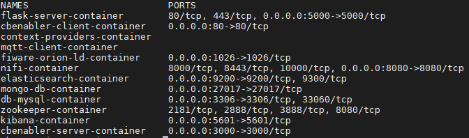
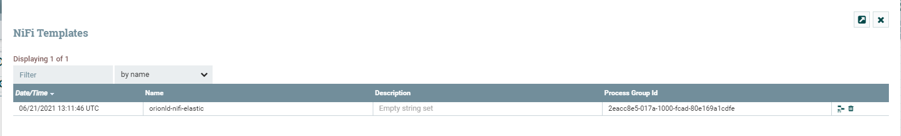
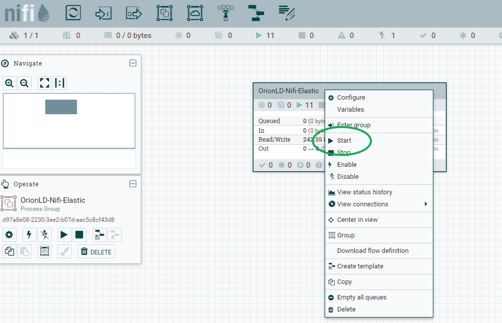

# Tutorials for deployment

## Content

- [Local/Cloud environment](#local-cloud-environment)

## Local/Cloud environment

This option is recommended for those users who want to deploy the Context Broker Heritage Conservation in a local environment or in a cloud environment that have Windows or Linux operating systems.

The steps for the deployment are the following:

1. Clone the repo if you don't have in the installation step. For cloning the repo execute the following command in the folder that you decide to build the Context Broker Heritage Conservation.

    ```bash
    cd workspace/
    git clone https://github.com/ConnectingEurope/Context-Broker-Heritage-Conservation.git
    ```

2. Check if Docker is running on the computer.

3. Open a terminal and go to the folder: **workspace/src**

    ```bash
    cd workspace/src
    ```

4. Edit the .env file and changes the parameters with your configuration. In the file you can change the paths, the version of the base image and the ports.

5. Edit the docker-compose.yml file and changes the parameters with your configuration.

6. Edit the config.py file in **code > src > config** for change the users, passwords, routes and GeoJSON.

7. In case of **Windows** run the script called **deploy_windows.bat**:

    ```bash
    deploy_windows.bat
    ```

    In case of **Linux** run the script called **deploy_linux.sh**

    ```bash
    sh deploy_linux.sh
    ```

8. Now, the needed images are being downloaded from DockerHub and the Docker Compose will be able to build the containers. The containers will be started after the download and build.

9. Execute the following command in the terminal:

    ```bash
    docker ps
    ```

10. There should be **twelve new containers in Docker**:

    - flask-server-container
    - cbenabler-client-container
    - context-providers-container
    - mqtt-client-container
    - fiware-orion-ld-container
    - nifi-container
    - elasticsearch-container
    - mongo-db-container
    - db-mysql-container
    - zookeeper-container
    - kibana-container
    - cbenabler-server-container

        
        >*Illustration 1. Docker images of Local/Cloud environment tutorial*

11. At the beginning the Apache Nifi interface is empty, so we have to upload the custom execution flow.
    - Upload template: Click on the button to upload the template on the left panel and choose the template "orionld-nifi-elastic.xml". This template is inside the volume of nifi, you have to download it, and you must have it in local in order to be able to upload it.

    
    >*Illustration 2. Nifi template*

    - Create template module: Drag the template module from the top menu to the centre of the screen, when you stop dragging a new window will appear, and you will have to select the template uploaded in the previous step.
    - Run the process: Finally, when the module "OrionLD-Nifi-Elastic" is loaded, you can start the process by clicking on the play button on the left menu.

    
    >*Illustration 3. Nifi Start flow process*

12. Go to the web browser and try to access the Context Broker Heritage Conservation using the following URL:

    Local environment:
    ```url
    localhost
    ```

    Cloud environment:
    ```url
    http://public IP address //example: http://172.167.80.195
    ```

    If the deployment was done succesfully, you should see the Context Broker Heritage Conservation.

[Top](#tutorials-for-deployment)